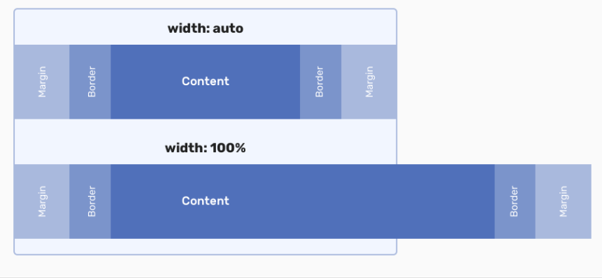

웹사이트 만들때 가장먼저 할것
레이아웃 : 덩어리로 구분짓기. 크게 보기

---

```css
div {
  background-color: orange;
  width: auto; /* 부모기준 */
  height: auto; /* 자식기준 */
}
```

- `Type Selector (유형 선택자)`: div
- `property` : background-color
- `value` : orange;
- `width` : auto // initial value
- `width`:100% VS auto  
   auto : 마진 패딩 보더를 고려하여 부모의 컨텐츠 영역 너비만큼  
   100% : 단순 부모 컨텐츠 영역 픽셀값 계산  
  

---

```css
div {
  background-color: orange;
  width: 200px;
  height: 200px;
  margin-left: auto;
}
```

`margin-left: auto` : block 레벨에서 가용공간의 여백을(모두) 취하겠다.  
https://chromium.googlesource.com/chromium/src/third_party/+/master/blink/renderer/core/html/resources/html.css  
기본 display 설정(크롬)을 볼수 있다.

---

```css
div {
  margin-right: auto;
  margin-left: auto;
}
```

block 레벨에서 좌우 가용공간의 여백을 취한다 => 가운데로 정렬된다.

---

https://caniuse.com/  
css 호환성 체크 사이트

css 작업하기 전에 `Type Selector`를 적극 활용하여 margin 등을 초기화 한다  
브라우저마다 initial 값이 다를 수 있기 때문

`inline elements` 는 `text-align` 에 반응한다
`margin: auto` 는 `block` 레벨의 요소 배치에 사용.
// 배경색을 넣어서 공간을 어떻게 차지 하는지 확인 할수있다.

- `CSS의 inherit`  
  상위요소에 프로퍼티를 추가하면 하위요소에도 적용한다.  
  모든 요소가 상속되는건 아니다.

```css
h1 {
  font-size: inherit;
  font-weight: inherit;
}
```

부모요소로 부터 값을 상속받기 위해 `inherit` 값으로 초기화  
상속이 지원되는 프로퍼티 값을 초기화 할때 주로 사용

`width: fit-content` 컨텐츠 만큼 너비가 설정됨.

`a` 태그에서 여백이 있는 이유 : html 개행에 의한 한칸 띄어쓰기다. 마진이 아님

inline elements는 마진을 줄때 좌우만 적용된다.

contents(프로필 사진 등)가 아닌 그림요소(아이콘 등)는 CSS에서 처리해주자.

셀렉터가 얼마나 구체적인지에 따라 점수가 매겨진다. 높은 점수의 셀렉터를 우선순위로 적용한다.
`Selecto specificity` 참조
