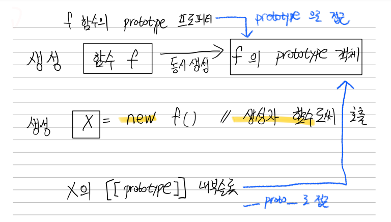

# 함수와 일급객체

## 18.1 일급객체

> 일급객체란?

- 무명의 리터럴로 생성가능
- 변수나 자료구조에 저장가능
- 함수의 매개변수로 전달가능
- 함수 반환값으로 사용가능

함수는 객체다 -> 객체는 값이므로 값을 사용할수 있는곳 어디는 사용 가능

---

## 18.2 함수 객체의 프로퍼티

함수는 객체이므로 프로퍼티를 갖는다.

```js
//브라우저 콘솔 실습
function square(number) {
  return number * number;
}

console.dir(square);
```

```js
function square(number) {
  return number * number;
}

console.log(Object.getOwnPropertyDescriptors(square));

// __proto__는 square 함수의 프로퍼티가 아니다.
console.log(Object.getOwnPropertyDescriptor(square, "__proto__")); // undefined

// __proto__는 Object.prototype 객체의 접근자 프로퍼티다.
// square 함수는 Object.prototype 객체로부터 __proto__ 접근자 프로퍼티를 상속받는다.
console.log(Object.getOwnPropertyDescriptor(Object.prototype, "__proto__"));
```

### 18.2.1 arguments 프로퍼티

```js
function multiply(x, y) {
  console.log(arguments);
  return x * y;
}

console.log(multiply(1, 2, 3)); // 2
```

매개변수 개수를 확정할 수 없는 가변 인자 함수를 구현할때 유용하게 쓰임

arguments 객체는 유사 배열 객체

> 유사 배열 객체?

- length 프로퍼티를 가진 객체로 for문으로 순회 가능
- 배열이 아니기 때문에 배열 메서드 사용시 에러

```js
function sum(...args) {
  return args.reduce((pre, cur) => pre + cur, 0);
}

console.log(sum(1, 2)); // 3
console.log(sum(1, 2, 3, 4, 5)); // 15
```

### 18.2.2 caller 프로퍼티

-비표준 프로퍼티(표준화 예정x)

### 18.2.3 length 프로퍼티

함수 정의할때 선언한 매개변수 개수

arguments 의 length는 인자의 개수 <-> length 프로퍼티는 매개변수 개수

### 18.2.4 name 프로퍼티

```js
//기명 함수 표현식
var namedFunc = function foo() {};
console.log(namedFunc.name); // foo

// 익명 함수 표현식
var anonymousFunc = function () {};
console.log(anonymousFunc.name); // anonymousFunc

// 함수 선언문(Function declaration)
function bar() {}
console.log(bar.name); // bar
```

### 18.2.5 **proto** 프로퍼티

모든 객체는 [[Prototype]] 이라는 내부슬롯을 갖는다.
[[Prototype]] 은 프로토타입 객체를 가리킨다.

**proto** 프로퍼티를 사용하여 [[Prototype]]이 가리키는 프로토타입 객체에 접근 가능하다

### 18.2.6 prototype 프로퍼티

prototype 프로퍼티는 생성자 함수로 호출할 수 있는 함수 객체만 소유하는 프로퍼티

```js
// 함수 생성 (생성자 함수로 호출 가능)
function Circle(radius) {
  this.radius = radius;
  this.getArea = function () {
    return Math.PI * this.radius ** 2;
  };
}

// 인스턴스 생성
const circle1 = new Circle(1);

console.log(Circle.prototype == circle1.__proto__); // true
```


