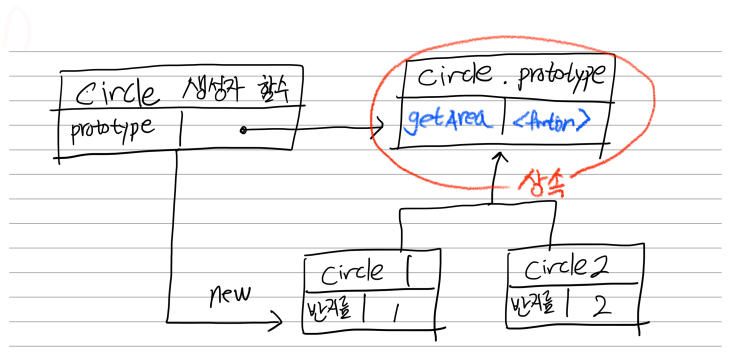
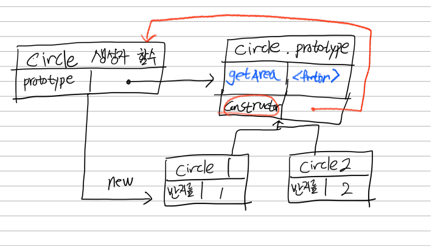
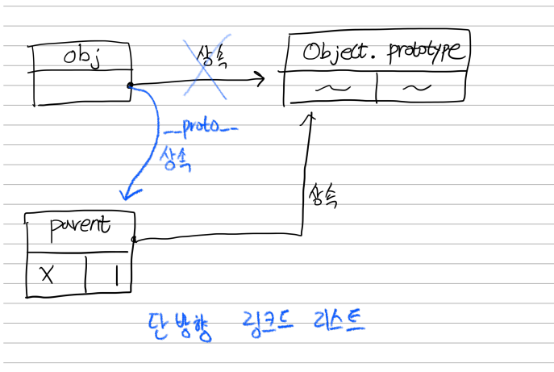
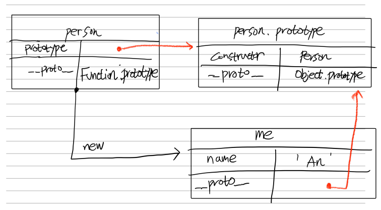
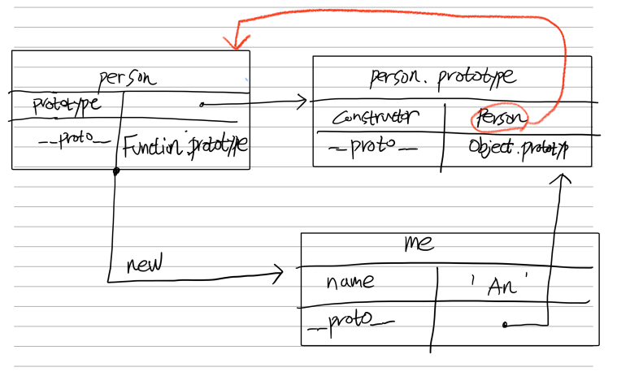

# 프로토타입

자바스크립트는

- 명령형
- 함수형
- **_프로토타입 기반 객체지향 프로그래밍_**

을 지원하는 멀티 패러다임 프로그래밍 언어다.

## 19.1 객체지향 프로그래밍

프로그래밍에서 필요한 데이터를 추상화시켜 상태와 행위를 가진 객체를 만들고  
그 객체들 간의 유기적인 상호작용을 통해 로직을 구성하는 프로그래밍 방법

```js
//추상화
const me = {
    name: 'An',
    address:'Incheon'
    cook() {
        return '라면'
    }
}
```

객체: 데이터와 동작을 하나의 단위로 묶은 자료구조

## 19.2 상속과 프로토타입

```js
// 생성자 함수
function Circle(radius) {
  this.radius = radius;
  this.getArea = function () {
    return Math.PI * this.radius ** 2;
  };
}

const circle1 = new Circle(1);
const circle2 = new Circle(2);

// getArea 메서드를 중복 생성하고 모든 인스턴스가 중복 소유한다.
console.log(circle1.getArea === circle2.getArea); // false
```

동작이 같은 getArea 메서드를 중복 생성하고있다

```js
// 생성자 함수
function Circle(radius) {
  this.radius = radius;
}

Circle.prototype.getArea = function () {
  return Math.PI * this.radius ** 2;
};

// 인스턴스 생성
const circle1 = new Circle(1);
const circle2 = new Circle(2);

console.log(circle1.getArea === circle2.getArea); // true
```



## 19.3 프로토타입 객체

모든 객체는 [[prototype]] 이라는 내부슬롯을 갖는다.
객체가 생성된 방식에 따라 [[prototype]] 에 저장되는 프로토타입 객체가 결정된다.

> constructor

```js
function Circle(radius) {
  this.radius = radius;
}
Circle.prototype.getArea = function () {
  return Math.PI * this.radius ** 2;
};

// 인스턴스 생성
const circle1 = new Circle(1);

circle1.constructor; //
```



### 19.3.1 **proto** 접근자 프로퍼티

```js
const obj = {};
```

객체 리터럴로 생성된 obj의 prototype은 Object.prototype이다

[[prototype]] 내부슬롯은 프로퍼티가 아니기 때문에 직접 접근 불가
**proto** 프로퍼티를 통해 간접적으로 접근

```js
const obj = {};
const parent = { x: 1 };
obj.__proto__ = parent;
```



**proto** 직접 사용 권장하지 않는다. 모든 객체가 **proto** 를 사용할수 있는것은 아니기 때문

대신 Object.getPrototypeOf() 메서드 사용 권장

```js
Object.setPrototypeOf(obj, parent); // obj.__proto__ = parent;
```

### 19.3.2 함수 객체의 prototype 프로퍼티

생성자 함수로 호출할 수 있는 함수만 갖는 프로퍼티
(화살표 함수와 같은 non-constructor 함수는 없다)

```js
function Person(name) {
  this.name = name;
}

const me = new Person("Lee");

// 결국 Person.prototype과 me.__proto__는 결국 동일한 프로토타입을 가리킨다.
console.log(Person.prototype === me.__proto__); // true
```



객체의 **proto**: **객체**가 자신의 프로토타입에 **접근**하거나 **교체**할때 사용  
함수의 prototype : **생성자 함수**가 자신이 생성할 객체의 프로토타입을 **할당**하기 위해 사용

### 19.3.3 프로토타입의 constructor 프로퍼티와 생성자 함수

모든 프로토타입 객체는 constructor 프로퍼티를 갖는다.
함수가 생성될때 constructor는 자신을 참조하는 생성자 함수를 가리킨다.

```js
function Person(name) {
  this.name = name;
}

const me = new Person("Lee");

console.log(me.constructor === Person); // true
```



---

## 19.4 리터럴 표기법에 의해 생성된 객체의 생성자 함수와 프로토타입

```js
// 객체 리터럴
const obj = {
  name: "hs",
  age: "27",
  sayhi() {
    console.log("hi");
  },
};
obj.__proto__ === Object.prototype; // true
```

리터럴로 생성한 객체도 상속을 위한 프로토타입이 필요합니다.  
ex)

```js
obj.sayhi(); // hi
obj.toString(); //[object type] 을 반환
```

obj에 선언한적 없는 toString 메서드를 사용할수 있는 이유는?

-> 프로토타입을 상속했기 때문

객체 리터럴의 프로토타입은 어떻게 연결되는 것일까요?

-> 객체 리터럴을 생성할때 **OrdirnaryObjectCreate**라는 추상연산이 호출되어 Object.prototype 을 프로토타입으로 갖는 객체 생성

쉽게 이야기 해서 자바스크립트를 만든 사람이 그렇게 되도록 만들어 놨다 (뒷장에 더 자세한 정보)

> 추상연산?

- 자바스크립트 내부 동작을 설명하는 의사코드
