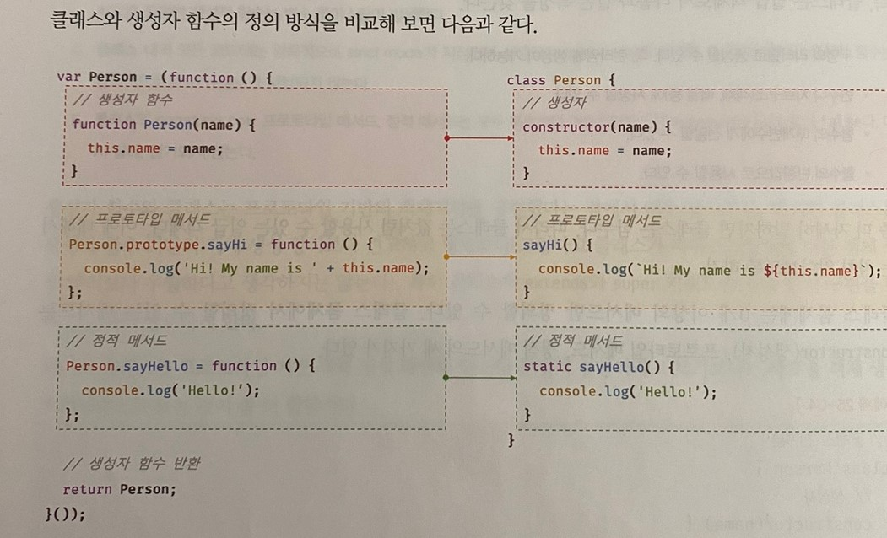
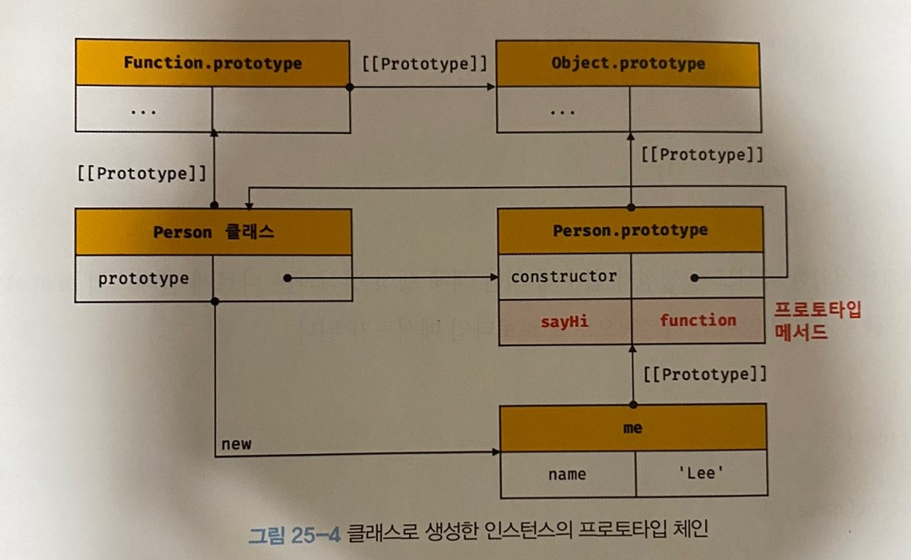
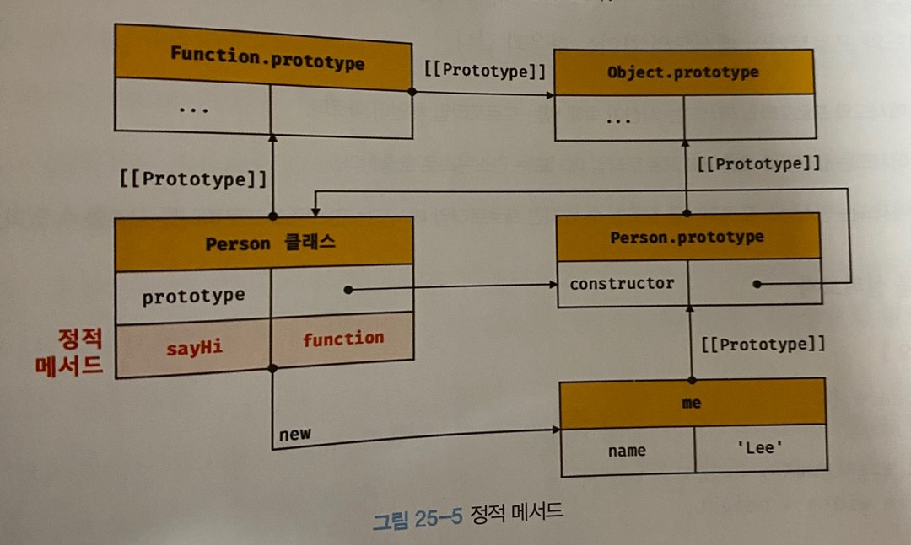

# 25장 클래스

## 25.1 클래스는 프로토타입의 문법적 설탕인가?

> 문법적 설탕?  
>  동일한 동작. 읽는 사람 또는 작성하는 사람이 편하게 디자인 된 문법

js의 클래스는 기존 생성자 함수를 클래스 기반 패턴처럼 사용할 수 있도록 하는 `문법적 설탕이라고 볼 수도 있다`.

> 클래스 vs 생성자 함수

- 클래스는 `new` 연산자 없이 호출 불가. 생성자 함수는 일반함수로 동작됨

- 클래스는 상속을 지원하는 `extends` 와 `super` 키워드를 제공

- 클래스는 호이스팅이 발생되지 않는 것처럼 동작한다.

- 클래스 내의 코드는 암묵적으로 `strict` 모드로 실행

- 클래스의 `constructor`, 프로토타입 메서드, 정적 메서드는 모두 `[[Enumerable]]` 값이 `false` 다.

클래스는 생성자 함수의 객체 생성 방식보다 견고하고 명료하다.  
특히 `extends` 와 `super` 키워드는 상속 관계 구현을 더욱 명료하게 한다.

**따라서 클래스를 문법적 설탕이라기 보다는 새로운 객체 생성 메커니즘으로 보는것이 더 합당하다.**

## 25.2 클래스 정의

```js
// 클래스 선언문
class Person {}

// 익명 클래스 표현식
const Person = class {};

// 기명 클래스 표현식
const Person = class MyClass {};
```

생성자 함수와 마찬가지로 `파스칼 케이스`를 사용.  
일반적이지 않지만 `표현식`으로 정의 가능

클래스 몸체에는 constructor, 프로토타입 메서드, 정적 메서드 세가지를 정의할 수 있다.

```js
class Person {
  //생성자
  constructor(name) {
    // 인스턴스 생성 및 초기화
    this.name = name;
  }

  // 프로토타입 메서드
  sayHi() {
    console.log(`Hi! My name is ${this.name}`);
  }

  // 정적 메서드
  static sayHello() {
    console.log("Hello!");
  }
}

const me = new Person("Lee");
```

클래스와 생성자 함수 비교


## 25.3 클래스 호이스팅

`클래스는 함수`로 평가된다.
클래스는 생성자 함수로 호출할수 있는 `constructo`r이다
따라서 코드 평과 과정에서 런타임 이전에 함수 객체를 생성한다.
프로토타입 또한 같이 생성된다.

단, 클래스는 정의 이전에 참조할 수 없다

클래스는 호이스팅이 발생 하지만 let, const와 같이 `일시적 사각지대`에 빠지게 된다.

## 25.4 인스턴스 생성

클래스는 인스턴스를 생성하는 것이 유일한 존재 이유!  
반드시 `new` 와 함께 호출해야 한다.

`new` 없이 호출하면 에러!

```js
class Person {}

// 클래스를 new 연산자 없이 호출하면 타입 에러가 발생한다.
const me = Person();
// TypeError: Class constructor Person cannot be invoked without 'new'
```

표현식으로 정의된 클래스는 `식별자`(Person)를 사용해 생성해야 한다
기명 클래스 표현식의 이름을 사용하면 에러가 발생!

```js
const Person = class MyClass {};

// 함수 표현식과 마찬가지로 클래스를 가리키는 식별자로 인스턴스를 생성해야 한다.
const me = new Person();

// 클래스 이름 MyClass는 함수와 동일하게 클래스 몸체 내부에서만 유효한 식별자다.
console.log(MyClass); // ReferenceError: MyClass is not defined

const you = new MyClass(); // ReferenceError: MyClass is not defined
```

## 25.5 메서드

클래스 몸체에는 `constructor` ,`프로토타입 메서드`, `정적 메서드` 를 선언할 수 있다.

### 25.5.1 constructor

인스턴스를 `생성`하고 `초기화`하기 위한 특수 메서드

```js
class Person {
  // 생성자
  constructor(name) {
    // 인스턴스 생성 및 초기화
    this.name = name;
  }
}

const me = new Person("lee");
console.log(me);
```

생성자 함수와 마찬가지로 `constructor` 내부 `this` 에 추가한 `name` 프로퍼티가 인스턴스의 프로퍼티로 추가된 것을 확인할수 있다.

`constructor` 는 단순 메서드로 해석되지 않고 클래스 정의 평가시 함수 객체 코드의 일부가 된다. 다시 말해, 클래스 정의가 평가되면 `constructor` 의 기술된 동작을 하는 함수 객체가 된다.

`constructor` 의 특징은 다음과 같다.

-생략할수 있다. 생략하면 암묵적으로 빈 `constructor`가 정의된다.

```js
class Person {
  // constructor를 생략하면 다음과 같이 빈 constructor가 암묵적으로 정의된다.
  constructor() {}
}

// 빈 객체가 생성된다.
const me = new Person();
console.log(me); // Person {}
```

-프로퍼티가 있는 인스턴스를 생성하려면 `constructor` 에 매개변수를 선언하고 인스턴스 생성시 초기값을 전달한다.

```js
class Person {
  constructor(name, address) {
    // 인수로 인스턴스 초기화
    this.name = name;
    this.address = address;
  }
}

// 인수로 초기값을 전달한다. 초기값은 constructor에 전달된다.
const me = new Person("Lee", "Seoul");
console.log(me); // Person {name: "Lee", address: "Seoul"}
```

이처럼 `constructor` 내에서는 `인스턴스의 생성`과 동시에 인스턴스 프로퍼티 추가를 통해 `인스턴스의 초기화`를 실행한다.
따라서 인서턴스를 초기화 하려면 `constructor` 를 생략해서는 안 된다.

```js
class Person {
  constructor(name) {
    this.name = name;

    // 명시적으로 객체를 반환하면 암묵적인 this 반환이 무시된다.
    return {};
  }
}

// constructor에서 명시적으로 반환한 빈 객체가 반환된다.
const me = new Person("Lee");
console.log(me); // {}
```

constructor에 객체값 반환을 명시하면 인스턴스가 반환 되지 않고 반환값이 들어간다

```js
class Person {
  constructor(name) {
    this.name = name;

    // 명시적으로 원시값을 반환하면 원시값 반환은 무시되고 암묵적으로 this가 반환된다.
    return 100;
  }
}

const me = new Person("Lee");
console.log(me); // Person { name: "Lee" }
```

그러나 원시값을 반환하면 무시하고 this 반환.

constructor 내부에서 다른 값을 반환하는것은 기본동작 훼손!
return 반드시 생략해야함

### 25.5.2 프로토타입 메서드

생성자 함수에서 프로토타입 메서드를 생성하는법

```js
// 생성자 함수
function Person(name) {
  this.name = name;
}

// 프로토타입 메서드
Person.prototype.sayHi = function () {
  console.log(`Hi! My name is ${this.name}`);
};

const me = new Person("Lee");
me.sayHi(); // Hi! My name is Lee
```

클래스에서는 prototype에 메서드를 추가하지 않아도 된다.

```js
class Person {
  constructor(name) {
    this.name = name;
  }

  // 프로토타입 메서드
  sayHi() {
    console.log(`Hi! My name is ${this.name}`);
  }
}

const me = new Person("Lee");
me.sayHi(); // Hi! My name is Lee
```

생성자 함수와 마찬가지로 클래스가 생성한 인스턴스는 프로토타입 체인의 일원이 된다.


```js
// me 객체의 프로토타입은 Person.prototype이다.
Object.getPrototypeOf(me) === Person.prototype; // -> true
me instanceof Person; // -> true

// me 객체의 constructor는 Person 클래스다.
me.constructor === Person; // -> true
```

결국 클래스도 인스턴스를 생성하는 생성자 함수다!

### 25.5.3 정적 메서드

생성자 함수에서 정적 메서드

```js
function Person(name) {
  this.name = name;
}

// 정적 메서드
Person.sayHi = function () {
  console.log("Hi!");
};

// 정적 메서드 호출
Person.sayHi(); // Hi!
```

클래스에서 정적 메서드

```js
class Person {
  constructor(name) {
    this.name = name;
  }

  // 정적 메서드
  static sayHi() {
    console.log("Hi!");
  }
}

Person.sayHi();
```



정적 메서드는 클래스에 바인딩된 메서드가 된다.

정적메서드는 프로토타입 메서드처럼 인스턴스로 호출하지 않고 클래스로 호출된다.

### 25.5.4 정적 메서드와 프로토타입 메서드의 차이

1. 자신이 속해있는 프로토타입 체인이 다르다
2. 정적 => 클래스로 호출 , 프로토타입 메서드 => 인스턴스로 호출
3. 정적메서드는 인스턴스 프로퍼티 참조 불가, 프로토타입 메서드는 인스턴스 프로퍼티 참조 가능

정적 메서드는 인스턴스의 프로퍼티를 참조하지 않았다.  
정적메서드 내부 this 는 클래스를 가리킨다.(메서드를 호출한 객체)

```js
class Square {
  // 정적 메서드
  static area(width, height) {
    return width * height;
  }
}

console.log(Square.area(10, 10)); // 100
```

여기서 this는 square 인스턴스

```js
class Square {
  constructor(width, height) {
    this.width = width;
    this.height = height;
  }

  // 프로토타입 메서드
  area() {
    return this.width * this.height;
  }
}

const square = new Square(10, 10);
console.log(square.area()); // 100
```

메서드 내부에서 인스턴스 프로퍼티를 참조할 필요가 있다면 this 사용.
이런 경우 프로토타입 메서드로 정의해야함.  
하지만 메서드 내부에서 인스턴스 프로퍼티 참조할 필요가 없다면 this 를 사용하지 않게 된다.  
따라서 this 를 사용하지 않는 메서드는 정적메서드로 정의 하는것이 좋다.

### 25.5.5 클래스에서 정의한 메서드 특징

1. `function` 키워드 생략
2. `콤마` 필요없음
3. `strict mode`로 실행
4. `열거가 불가`한 값이어서 for... in문 등 메서드 사용 불가
5. non-constructor 이기 때문에 `new 사용 불가`

## 25.6 클래스의 인스턴스 생성과정

1. 인스턴스 생성과 this 바인딩  
   `new` 연산자와 클래스를 호출하면 `constructor` 내부코드 실행에 앞서 `빈객체(인스턴스)`가 생성되고 `prototype` 이 설정된다. `constructor` 내부 `this`는 인스턴스를 가리킨다.

2. 인스턴스 초기화  
   `constructor` 내부 코드가 실행되어 인스턴스에 `프로퍼티를 추가`하고 값을 `초기화` 한다.

3. 인스턴스 반환  
   모든 처리가 끝나면 인스턴스가 바인딩된 `this가 암묵적으로 반환`된다.

## 25.7 프로퍼티

### 25.7.1 인스턴스 프로퍼티

인스턴스 프로퍼티는 constructor 내부에서 정의한다.

```js
class Person {
  constructor(name) {
    // 인스턴스 프로퍼티
    this.name = name;
  }
}

const me = new Person("Lee");
console.log(me); // Person {name: "Lee"}
```

constructor 내부 코드 실행전 이미 this에는 인스턴스 빈 객체가 바인딩 되어있다.
this에 프로퍼티를 추가하면 인스턴스에 프로퍼티가 추가된다.

## 25.7.2 접근자 프로퍼티

`접근자 프로퍼티`는 값은 갖지 않고 다른 데이터 프로퍼티 값을 `읽거나 저장`할때 사용하는 `접근자 함수로 구성된 프로퍼티`다.

```js
class Person {
  constructor(firstName, lastName) {
    this.firstName = firstName;
    this.lastName = lastName;
  }

  // fullName은 접근자 함수로 구성된 접근자 프로퍼티다.
  get fullName() {
    return `${this.firstName} ${this.lastName}`;
  }

  set fullName(name) {
    [this.firstName, this.lastName] = name.split(" ");
  }
}

const me = new Person("Ungmo", "Lee");

// 데이터 프로퍼티를 통한 프로퍼티 값의 참조.
console.log(`${me.firstName} ${me.lastName}`); // Ungmo Lee

// 접근자 프로퍼티 fullName에 값을 저장하면 setter 함수가 호출된다.
me.fullName = "Heegun Lee";
console.log(me); // {firstName: "Heegun", lastName: "Lee"}

// 접근자 프로퍼티 fullName에 접근하면 getter 함수가 호출된다.
console.log(me.fullName); // Heegun Lee
```

`getter`, `setter` 함수는 호출하는 것이 아니라 `프로퍼티`처럼 참조하는 형식으로 사용한다.
프로퍼티처럼 값을 할당하는 형식으로 사용한다.

클래스 메서드는 기본적으로 프로토타입 메서드가 된다. 따라서 접근자 프로퍼티 또한 `프로토타입의 프로퍼티`가 된다.

### 25.7.3 클래스 필드 정의 제안

> 클래스필드: 클래스가 생성한 인스턴스의 프로퍼티를 가리키는 용어

```js
class Person {
  // 클래스 필드 정의
  name = "Lee";
}

const me = new Person("Lee");
```

this 에 클래스필드를 정의하면 에러

```js
class Person {
  // this에 클래스 필드를 바인딩해서는 안된다.
  this.name = ''; // SyntaxError: Unexpected token '.'
}
```

인스턴스 생성시 외부 초기값으로 클래스 필드를 초기화 할 필요가 있다면 constructor 에서 클래스 필드를 초기화 해야 한다.

```js
class Person {
  name;

  constructor(name) {
    // 클래스 필드 초기화.
    this.name = name;
  }
}

const me = new Person("Lee");
console.log(me); // Person {name: "Lee"}
```

이처럼 인스턴스를 생성할 때 클래스 필드를 초기화 할 필요가 있다면 constructor 밖에서 클래스 필드를 정의할 필요가 없다.

함수를 클래스 필드에 할당할 수 있다. 클래스필드로 메서드를 정의 가능하다.

```js
class Person {
  // 클래스 필드에 문자열을 할당
  name = "Lee";

  // 클래스 필드에 함수를 할당
  getName = function () {
    return this.name;
  };
}
const me = new Person();
console.log(me.getName()); // Lee
```

이처럼 클래스 필드에 함수를 할당하는 경우, 이 함수는 프로토타입 메서드가 아닌 `인스턴스 메서드`가 된다. `모든 클래스필드는 인스턴스 프로퍼티`가 되기 때문이다. 따라서 클래스 필드에 함수를 할당하는 것은 권장 하지 않는다.

인스턴스를 생설할때 외부 초기값으로 클래스 필드를 초기화할 필요가 없다면 기존의 constructor에서 인스턴스 프로퍼티를 정의하는 방식과 클래스 필드 정의 제안 모두 사용 가능.

### 25.7.4 private 필드 정의 제안

인스턴스 프로퍼티는 인스턴스를 통해 클래스 외부에서 언제나 참조할 수 있는 `public`이다.  
이를 위해 나온것이` private 필드`이다.

```js
class Person {
  // private 필드 정의
  #name = "";

  constructor(name) {
    // private 필드 참조
    this.#name = name;
  }
}

const me = new Person("Lee");

// private 필드 #name은 클래스 외부에서 참조할 수 없다.
console.log(me.#name);
// SyntaxError: Private field '#name' must be declared in an enclosing class
```

`private 필드`는 오직 클`래스 내부에서만 참조` 가능하다.  
`private 필드`는 반드시 `클래스 몸체에 정의`해아한다. `constructor` 내부에 정의하면 에러 발생

### 25.7.5 static 필드 정의 제안

정적 메서드처럼 정적 필드를 정의할 수 있다.

```js
class MyMath {
  // static public 필드 정의
  static PI = 22 / 7;

  // static private 필드 정의
  static #num = 10;

  // static 메서드
  static increment() {
    return ++MyMath.#num;
  }
}

console.log(MyMath.PI); // 3.142857142857143
console.log(MyMath.increment()); // 11
```
