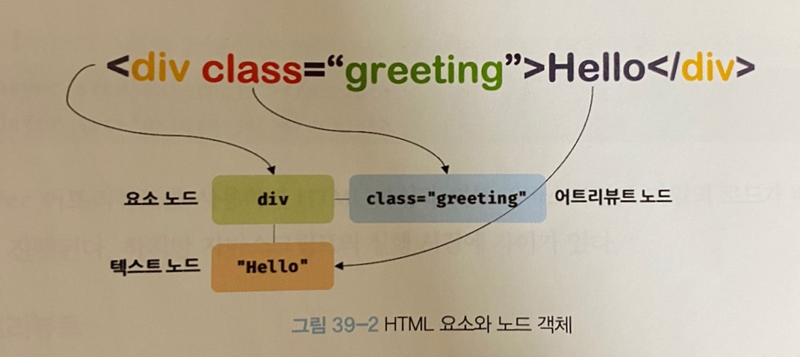
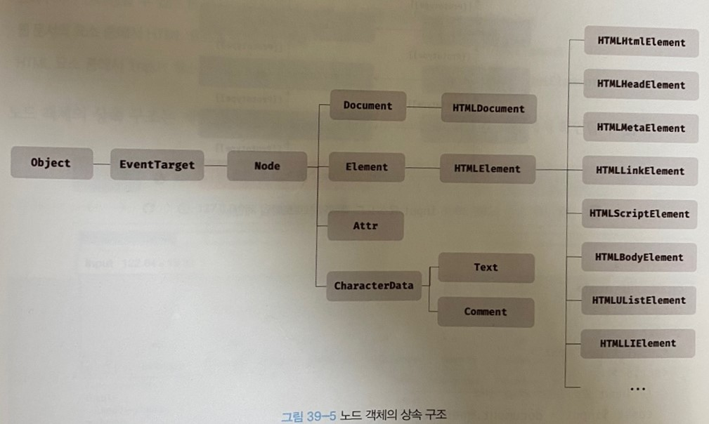
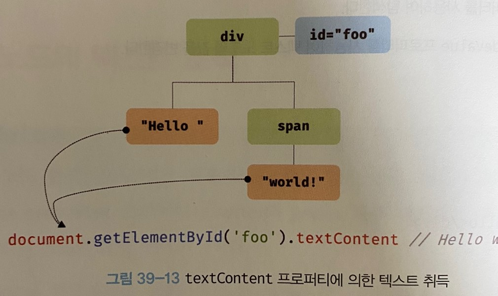

# 39장 DOM

HTML 문서의 계층적 구조와 정보를 표현하며 이를 제어할수 있는 API.  
DOM은 프로퍼티와 메서드를 제공하는 트리 자료구조다

## 39.1 노드

### 39.1.1 요소와 노드 객체

- 요소 : HTML 문서를 구성하는 개별적인 요소
- 노드 객체 : 요소를 파싱한것



노드 객체들로 구성된 트리 자료구조를 DOM 이라 한다.

### 39.1.2 노드 객체의 타입

12개의 노드 타입이 있다. 그중 중요한것은 4가지

1. `문서 노드`  
   트리 최상위 루트노드로 document 객체를 가리킨다.
   전역객체 window 의 document프로퍼티에 바인딩 되어있다.
   script 가 분리되어 있어도 하나의 window를 공유하기 때문에 document 객체는 유일하다.

2. `요소노드`  
   HTML 요소를 가리키는 객체. HTML 요소 간 중첩에 의해 부자 관계를 가진다. 이를 통해 문서의 구조를 표현한다.

3. `어트리뷰트 노드`  
   요소의 어트리뷰트를 가리키는 객체.
   요소 노드와 연결되어있다.

4. `텍스트 노드`  
   HTML 요소의 텍스트를 가리킨다. 문서의 정보를 표현.

### 39.1.3 노드 객체의 상속 구조

노드 객체도 객체 (브라우저 호스트 객체) 이므로 프로토타입에 의한 상속 구조를 갖는다.



DOM 은 HTML 문서의 계층적 구조와 정보를 표현하는것은 물론 노드 객체의 종류, 즉 노드 타입에 따라 필요한 기능을 프로퍼티와 메서드의 집합인 DOM API로 제공한다.

[1.html]

## 39.2 요소 노드 취득

### 39.2.1 id를 이용한 요소 노드 취득

```js
const $elem = document.getElementById("~~~");
```

- id 값은 유일한 값이어야함
- 만약 중복이 있을 경우 첫번째 요소 노드 반환
- id를 부여하면 id 값과 동일한 전역 변수가 암묵적 선언되고 해당 노드 객체가 할당됨

### 39.2.2 태그 이름을 이용한 요소 노드 취득

```js
const $elem = document.getElementByTagName("~");
const $elem = Element.getElementByTagName("~");
```

- document.getElementByTagName 는 DOM 전체 요소 노드 탐색하여 반환
- Element.getElementByTagName 는 특정 요소의 자손만 탐색하여 반환

[3.html]

### 39.3.4 CSS 선택자를 이용한 요소 노드 취득

```js

/* 어트리뷰트 선택자: input 요소 중에 type 어트리뷰트 값이 'text'인 요소를 모두 선택 */
input[type=text] { ... }

/* 후손 선택자: div 요소의 후손 요소 중 p 요소를 모두 선택 */
div p { ... }

/* 자식 선택자: div 요소의 자식 요소 중 p 요소를 모두 선택 */
div > p { ... }

/* 인접 형제 선택자: p 요소의 형제 요소 중에 p 요소 바로 뒤에 위치하는 ul 요소를 선택 */
p + ul { ... }

/* 일반 형제 선택자: p 요소의 형제 요소 중에 p 요소 뒤에 위치하는 ul 요소를 모두 선택 */
p ~ ul { ... }

/* 가상 클래스 선택자: hover 상태인 a 요소를 모두 선택 */
a:hover { ... }

/* 가상 요소 선택자: p 요소의 콘텐츠의 앞에 위치하는 공간을 선택
   일반적으로 content 프로퍼티와 함께 사용된다. */
p::before { ... }

```

[4.html]

- document.querySelectorAll() 은 NodeList 객체를 반환한다.

### 39.2.6 HTMLCollection 과 NodeList

- `HTMLCollection` 과 `NodeList` 는 여러개 결과값을 반환하기 위한 DOM 컬렉션 객체다.
- 둘 다 유사배열 객체이면서 이터러블이다.
- 실시간 변화를 반영하는 살아있는 객체다.(NodeList는 경우에 따라)

1. HTMLCollection  
   `getElementByTagName`, `getElenemtByClassName` 메서드가 반환
   [5.html]

2. NodeList  
   위와 같은 부작용을 해결하기 위해 NodeList를 반환하는 `querySelectorAll` 메서드를 사용하는 방법이 있다.(non-live객체)  
   단, childNodes 프로퍼티가 반환하는 NodeList 객체는 라이브 객체이므로 주의!

위와 같은 이유로 안전하게 DOM 컬렉션을 사용하려면 객체를 배열로 변환하여 사용하는 것을 권장 (스프레드 문법, Array.form 활용)

## 39.3 노드 탐색

### 자식노드 탐색

```html
<!DOCTYPE html>
<html>
  <body>
    <ul id="fruits">
      <li class="apple">Apple</li>
      <li class="banana">Banana</li>
      <li class="orange">Orange</li>
    </ul>
  </body>
  <script>
    const $fruits = document.getElementById("fruits");

    // childNodes 프로퍼티가 반환한 NodeList에는 요소 노드뿐만 아니라 텍스트 노드도 포함되어 있다.
    console.log($fruits.childNodes);
    // NodeList(7) [text, li.apple, text, li.banana, text, li.orange, text]

    // children 프로퍼티가 반환한 HTMLCollection에는 요소 노드만 포함되어 있다.
    console.log($fruits.children);
    // HTMLCollection(3) [li.apple, li.banana, li.orange]

    // firstChild 프로퍼티는 텍스트 노드를 반환할 수도 있다.
    console.log($fruits.firstChild); // ?

    // lastChild 프로퍼티는 텍스트 노드를 반환할 수도 있다.
    console.log($fruits.lastChild); // #text

    // firstElementChild 프로퍼티는 요소 노드만 반환한다.
    console.log($fruits.firstElementChild); // ?

    // lastElementChild 프로퍼티는 요소 노드만 반환한다.
    console.log($fruits.lastElementChild); // li.orange
  </script>
</html>
```

[6.html]

### 부모 노드 탐색

```html
<!DOCTYPE html>
<html>
  <body>
    <ul id="fruits">
      <li class="apple">Apple</li>
      <li class="banana">Banana</li>
      <li class="orange">Orange</li>
    </ul>
  </body>
  <script>
    // 노드 탐색의 기점이 되는 .banana 요소 노드를 취득한다.
    const $banana = document.querySelector(".banana");

    // .banana 요소 노드의 부모 노드를 탐색한다.
    console.log($banana.parentNode); // ul#fruits
  </script>
</html>
```

### 형제 노드 탐색

```html
<!DOCTYPE html>
<html>
  <body>
    <ul id="fruits">
      <li class="apple">Apple</li>
      <li class="banana">Banana</li>
      <li class="orange">Orange</li>
    </ul>
  </body>
  <script>
    const $fruits = document.getElementById("fruits");

    // #fruits 요소의 첫 번째 자식 노드를 탐색한다.
    // firstChild 프로퍼티는 요소 노드뿐만 아니라 텍스트 노드를 반환할 수도 있다.
    const { firstChild } = $fruits;
    console.log(firstChild); // #text

    // #fruits 요소의 첫 번째 자식 노드(텍스트 노드)의 다음 형제 노드를 탐색한다.
    // nextSibling 프로퍼티는 요소 노드뿐만 아니라 텍스트 노드를 반환할 수도 있다.
    const { nextSibling } = firstChild;
    console.log(nextSibling); // li.apple

    // li.apple 요소의 이전 형제 노드를 탐색한다.
    // previousSibling 프로퍼티는 요소 노드뿐만 아니라 텍스트 노드를 반환할 수도 있다.
    const { previousSibling } = nextSibling;
    console.log(previousSibling); // #text

    // #fruits 요소의 첫 번째 자식 요소 노드를 탐색한다.
    // firstElementChild 프로퍼티는 요소 노드만 반환한다.
    const { firstElementChild } = $fruits;
    console.log(firstElementChild); // li.apple

    // #fruits 요소의 첫 번째 자식 요소 노드(li.apple)의 다음 형제 노드를 탐색한다.
    // nextElementSibling 프로퍼티는 요소 노드만 반환한다.
    const { nextElementSibling } = firstElementChild;
    console.log(nextElementSibling); // li.banana

    // li.banana 요소의 이전 형제 요소 노드를 탐색한다.
    // previousElementSibling 프로퍼티는 요소 노드만 반환한다.
    const { previousElementSibling } = nextElementSibling;
    console.log(previousElementSibling); // li.apple
  </script>
</html>
```

## 39.5 요소 노드 텍스트 조작

### nodeValue

노드 객체의 값(텍스트)를 반환한다.

```html
<!DOCTYPE html>
<html>
  <body>
    <div id="foo">Hello</div>
  </body>
  <script>
    // 문서 노드의 nodeValue 프로퍼티를 참조한다.
    console.log(document.nodeValue); // null

    // 요소 노드의 nodeValue 프로퍼티를 참조한다.
    const $foo = document.getElementById("foo");
    console.log($foo.nodeValue); // null

    // 텍스트 노드의 nodeValue 프로퍼티를 참조한다.
    const $textNode = $foo.firstChild;
    console.log($textNode.nodeValue); // Hello
  </script>
</html>
```

### textContent

요소 노드 콘텐츠 영역 내의 텍스트를 모두 반환한다.

```html
<!DOCTYPE html>
<html>
  <body>
    <div id="foo">Hello <span>world!</span></div>
  </body>
  <script>
    // #foo 요소 노드의 텍스트를 모두 취득한다. 이때 HTML 마크업은 무시된다.
    console.log(document.getElementById("foo").textContent); // Hello world!
  </script>
</html>
```



textContent 프로퍼티에 값을 할당하면 요소의 모든 자식 노드가 제거되고 할당 문자열이 추가된다.
이때 html 파싱이 되지 않는다.

> vs innerText
> innerText 는 CSS에 순종적. ex) css에 의해 비표시(visibility: hidden)로 지정된 텍스트 반환 안함

사용 안하는것이 좋다.

```js

```
