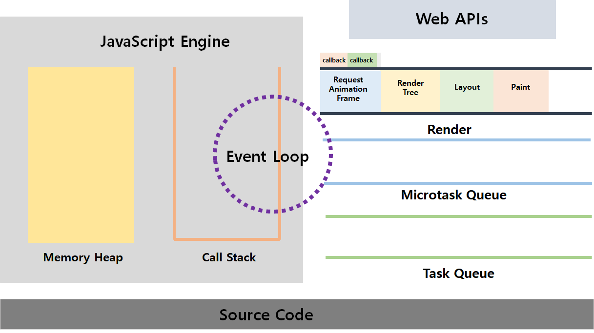

# 비동기 프로그래밍

## 이벤트 루프와 태스크큐

이벤트 루프 애니메이션

https://velog.io/@boram_in/%EC%9E%90%EB%B0%94%EC%8A%A4%ED%81%AC%EB%A6%BD%ED%8A%B8-%EB%94%A5%EB%8B%A4%EC%9D%B4%EB%B8%8C-42%EC%9E%A5-%EB%B9%84%EB%8F%99%EA%B8%B0-%ED%94%84%EB%A1%9C%EA%B7%B8%EB%9E%98%EB%B0%8D

## 비동기 시각화

비동기 실행 시각화
http://latentflip.com/loupe

```js
$.on("button", "click", function onClick() {
  setTimeout(function timer() {
    console.log("You clicked the button!");
  }, 2000);
});
```

## 비동기와 렌더링



> 우선순위 : 마이크로 태스크 큐 > 렌더 큐 > 태스크 큐

브라우저는 1초에 60프레임(16ms 마다)을 repaint 하는게 이상적.

그러나 자바스크립트 하는 어떤 일 때문에 리렌더링를 못함 (렌더는 콜백처럼 동작 하기 때문에 스택이 비워질때까지 기다려야함)

오래 걸리는 어떤 작업들을 비동기로 실행 하면 콜스택에 쓸데없는 코드를 쌓아서 브라우저가 할 일(유동적인 UI 구현)을 방해하는 것을 방지한다.

```js
//sync

[1, 2, 3, 4].forEach(function (i) {
  console.log("sync");
});

// async

function asyncForEach(arr, cb) {
  arr.forEach(function () {
    setTimeout(cb, 0);
  });
}

asyncForEach([1, 2, 3, 4], function (i) {
  console.log("async");
});
```
